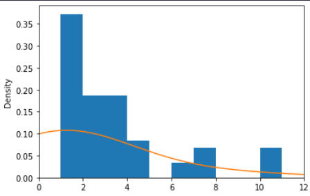
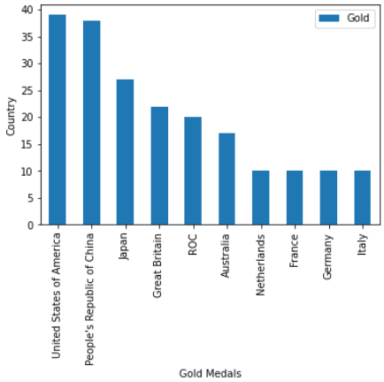

# Elements of Structured Data

Data must be put into a structured format for statistical operations

-   *Numeric:* 
              Data that are expressed on a numeric scale.
    -   *Continuous:*
                  Data that can take on any value in an interval. (Synonyms: interval, float, numeric)
    -   *Discrete:* 
                  Data that can take on only integer values, such as counts. (Synonyms: integer, count)
                  
-   *Categorical:* 
              Data that can take on only a specific set of values representing a set of possible categories. (Synonyms: enums, enumerated, factors, nominal)
    -   *Binary:* 
                    A special case of categorical data with just two categories of values, e.g., 0/1, true/false. (Synonyms: dichotomous, logical, indicator, Boolean)
    -   *Ordinal:* 
                  Categorical data that has an explicit ordering. (Synonym: ordered factor)

#### Rectangular Data

-  Rectangular data is a two-dimensional matrix with rows indicating records (cases) and columns indicating features (variables) aka dataframe.

#### Non-Rectangular Data

- produced by devices—the Internet of Things.
  
- Graphs, and other data types

# Estimates of Location

-   _Mean:_ sum of all values divided by the number of values

$$ mean(x)=\frac{\sum^n_{i=1}x_i}{n} $$

```python
import pandas as pd

medal_count = pd.read_excel("../DataSets/Medals.xlsx")
medal_count['Total'].mean()
```

-   _Weighted mean:_ Same as mean except you multiply every value of some $x_i$ before adding them up and dividing by the number of instances

$$ mean(x)=\frac{\sum^{n}_{i=1}w_ix_i}{\sum^{n}_{i = i}w_i} $$

```python
import pandas as pd
import numpy as np

np.average(medal_count['Total'], weights=medal_count['Gold'])
```

-   _Trimmed mean:_ Remove the top and bottom $x$ values from the dataset then calculate the mean

$$ mean(x)=\frac{\sum^{n - p}_{i = p + 1}x_i}{n-2p} $$

```python
import pandas as pd
from scipy.stats import trim_mean

trim_mean(medal_count['Gold'], 0.1)
```

This removes 10 % of data in the Gold column top and bottom before the calculation of the mean.

- _Robust_: A robust metric is not sensitive to outliers

-   _Median_: The middle value in a sorted list of value

```python
 import pandas as pd

medal_count["Total"].median()
```

Median is a better example of the average medal won than the mean.

-   _Weighted Median:_ Same as median except you multiply every value of some $x_i$ and pick the middle value, such that the sum of the value of the left of the median equals right of the median

```python
import pandas as pd

def weighted_mean(df, median_col, weighted_col) :
    df_sorted = df.sort_values(median_col)
    cumsum = df_sorted[weighted_col].cumsum()
    cutoff = df_sorted[weighted_col].sum() / 2
    return df_sorted[cumsum >= cutoff][median_col].iloc[0]

weighted_mean(medal_count, 'Total', 'Gold')
```

-   _Percentile_: The value such that $p$ per cent of the data lies below it

```python
import numpy as np
import pandas as pd

np.percentile(medal_count['Total'], 75)
```

_Outlier_: A value that is very different from most of the data

# Estimates of Variability (Dispersion Metrics)

-   _Variability_ is at the heart of statistics and where a lot of information on a dataset can be gleaned
    
-   _Deviations_: The difference between observed values and the estimate of location, called Errors or Residuals.
    
-   _Variance_ : Square the deviations, from the mean, divide by $n - 1$ , where $n$ is the number of instances ($\bar{x}$ → standard mean)
    

$$ Variance = s^2 = \frac{\sum^n_{i=1}(x_i-\bar{x})^2}{n-1} $$

```python
from statistics import variance

variance(medal_count['Gold')
```

-   _Standard Deviation_: Square root of the variance

$$ Standard \ Deviation = \sqrt{Variance} $$

```python
from statistics import stdev

stdev(medal_count['Gold'])
```

-   _Mean absolute deviation_: Mean of the absolute value of the deviations from the mean

$$ Mean \ absolute \ deviation = s^2 = \frac{\sum^n_{i=1}|x_i-\bar{x}|}{n} $$

```python
from numpy import mean, absolute

mean(absolute(medal_count['Gold'] - mean(medal_count['Gold'])))
```

-   _Median absolute deviation from the median_: Median of the absolute values of the deviation from the median

$$ median \ absolute \ deviation=Median(|x_1-m|, |x_2-m|, .... \ |x_i-m| ) $$

```python
from numpy import median, absolute

mean(absolute(medal_count['Gold'] - median(medal_count['Gold'])))
```

-   _Range_: Difference between the largest and smallest values in the dataset
    
-   _Order Statistics_: Metrics based on the data values sorted from smallest to biggest
    
-   _Percentile_: The value which is greatest than $P$ per cent of values in the dataset
    
-   _Interquartile Range_: Difference between the 75th and 25th percentile
    

```python
import numpy as np

q3, q1 = np.percentile(medal_count, [75, 25])
iqr = q3 - q1
```

# Standard Deviation and Related Estimates

Mean absolute deviation is one method to measure variability. It is simply the sum of the absolute values of all deviations (values - mean) divided by the number of instances.

Other metrics include the variance and standard deviation. The variance is an average of squared deviations, and the standard deviation is the square root of the variance.

All three of these metrics as **not robust against outliers** and the variance and standard deviation are particularly susceptible to outliers because of how they square their deviations.

The median absolute deviation is _robust against outliers and is calculated by taking the median of the absolute value of all values_ - the median

<aside> 💡 The variance, standard deviation, mean absolute deviation, and median absolute deviation is not equivalent estimates.

</aside>

<aside> 💡 Standard Deviation > Mean Absolute Deviation > Median Absolute Deviation

</aside>

## Estimates Based on Percentiles

Another method of measuring dispersion is looking at the spread of sorted data. Statistics based on sorted data are called order statistics. The Range is the most common of these statistics and is simply the maximum value minus the minimum value. This is incredibly sensitive to outliers so to avoid this we typically take statistics that ignore the highest and lowest percentile values. The Interquartile Range is the most famous of these statistics and is the 75th percentile minus the 25th percentile.

For very large datasets, it can get computationally intensive to calculate these statistics because it requires sorting the data, so a Machine Learning algorithm might estimate these statistics

# Exploring the Data Distribution

### Percentiles and Boxplots

Percentiles are a great way to summarize the tails of distribution such as the top 1%. You can also construct box plots which are a tremendous way to visually summarize the distribution of data in a dataset.


```python
medal_count.boxplot(column='Gold') 
```


### Frequency Tables and Histograms

Frequency tables divide the values of a variable into equally spaced segments and quantify the number of observations in each segment (basically a histogram not visualized)

```python
# Frequency Table

frequency_table = medal_count.copy()
frequency_table['freq'] = pd.cut(medal_count['Gold'], 10)
frequency_table.groupby('freq')['Rank'].count().reset_index()
```

```python
# Histogram
import matplotlib.pyplot as plt

# An "interface" to matplotlib.axes.Axes.hist() method
plt.hist(x=medal_count['Gold'], bins='auto', color='#0504aa',alpha=0.7, rwidth=0.85)
```


### Statistical Moments

-   _Mean (1st moment)_: 
      Average of all the data
      
-   _Variability (2nd moment) :_ 
      How closely values are spread around the mean (or another measure of central tendency)
      
-   _Skewness (3rd moment)_ : 
      The direction of the tail of the data → Discovered through visualization not a metric
      
-   _Kurtosis (4th moment)_ : 
      The propensity for data to have extreme

# Density Plot and Estimates

- A Density plot is a smoothed histogram that shows the distribution of data values as a continuous line, and the y-axis is plotted as proportion. 
- The proportion part is the key difference here, and the reason is that density plots are not the same as histograms.

```python
import matplotlib.pyplot as plt

ax = medal_count['Gold'].plot.hist(density=True, xlim=[0, 12], bins=range(1, 12))

medal_count['Gold'].plot.density(ax=ax)
```


## Exploring Binary and Categorical Data

- *Mode:*  Value that appears the most often
  
```python
medal_count["Gold"].mode()
```

- *Expected Value*: Sum of each value multiplied by the probability of occurrence

- *Bar Charts*: Plots each variable against it's frequency or proportion
  
```python
ax = medal_count.iloc[: 10].plot.bar(x='Team/NOC', y='Gold')

ax.set_xlabel("Gold Medals")

ax.set_ylabel("Country")
```


- *Pie Charts:*  Plots the frequency of each category as wedges of a pie (generally not a recommended chart type as the size of each pie can be difficult to compare)
  
```python
pie_data = medal_count.iloc[: 10]

plt.pie(pie_data['Gold'],labels=pie_data['Team/NOC'], autopct='%1.1f%%')
```


Probabilities are another way to describe categorical or binary data by grouping each variable with its likelihood of being chosen (proportional to the entire dataset)


# Exploring Two or More Variables

Means and variances are a form of univariate analysis, correlation is a form of bivariate analysis, and methods that look at more than two variables simultaneously are called multivariate analysis. 

After analyzing individual variables, you'll usually want to see how different variables interact with one another. When deciding which method to use, you must first determine whether you're comparing numerical variables to one another, numerical vs categorical variables, or categorical variables to one another.   

## Correlation
$$
r = \frac{\sum^n_{i=1}(x_i-x)(y_i-y)}{(n-1)s_xs_y}
$$
- *Correlation coefficient* : Generally use Pearson's Correlation Coefficient. The PCC Is sensitive to outliers. This measures how a change in one variable will change another variable.

- *Correlation matrix:* shows the correlation between all variables in a dataset. The primary diagonal will be 1's the entire way down.
  
```python
medal_count.corr()
```


- *Contingency Table*: 
      Tally counts between two or more variables
  
- *Hexagonal binning*: 
      Plots of two numeric variables with records binned into hexagons
      
```python
medal_count.plot.hexbin(x='Gold', y='Silver', gridsize=20)
```


- *Contour Plot*: 
      Plots showing the density of two numeric variables, similar to a topographical map  
      
```python
import seaborn as sns

sns.kdeplot(medal_count['Gold'], medal_count['Silver'])
```

  

- *Violin Plot*: 
    - Box plots for density estimates
      
```python
import seaborn as sns

sns.violinplot(medal_count['Gold'])
```


- *Scatterplot Plot:*
    - Plots one numerical variable on one axis vs another on a different axis, with each point correlating to a record. 
      
    - Scatterplots offer an excellent way to measure the relationship between two variables.

```python
medal_count.plot.scatter(x='Gold', y='Silver')
```


- *Heat Maps:* 
      Heat maps offer another way to look at data by using colours to communicate densities. Heatmaps can also be used with categorical variables 

```python
import seaborn as sns

sns.heatmap(medal_count.corr())
```


