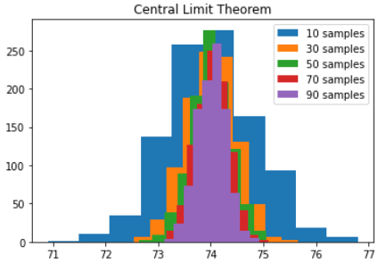

# Random Sampling

- *Sample:* 
	  A portion of the overall population. Usually taken when it is either too difficult to obtain or process statistics on the entire dataset

- *Population:* 
	  The totality of the dataset available 
	  
- *N (n):* 
	  The population size   

- *Random Sampling:* 
		Creates a samples by randomly picking portions of the population. i.e. splitting the polution by age groups
  
- *Stratified sampling:* 
	  Random samples that are taken after you split the total data into sections or "strata"   

- *Simple random sample:* 
	  Samples the results without breaking them up into strata   

- *Stratus (pl., strata):* 
	  Groups that the data is split into   

- *Bias:* 
	  Systematic error   

- *Sample bias:* A sample that misrepresents the population. i.e. spliting the populations into states  

- *$\bar{x}$:* The mean of your sample   

- *$\mu$:* The population mean of your sample

## Selection Bias   

- *Selection Bias:* 
	  Bias that results from how observations in data are selected   

- *Data Snooping:* 
	  Searching through data in order to find something interesting within it.
	  To prevent this, it's important to take apart a section of data, which is not prior to modeling.

- *Vast Search Effect:* 
	  A form of selection bias where one repeatedly runs different models asking different questions on a large dataset which increases the chances that an outlier is deemed interesting. One way to combat this is to have a holdout set of data that one can test their conclusions on.  

- *Target Shuffling:*
  
	- Another method to combat the Vast Search Effect where one creates a model and notes its efficacy, then shuffle the target variable around so your data is "wrong". Presumably a model trained on this data will not be very good. 
	  
	- Train a model on this data and repeat this process several times and plot the strength (using whatever accuracy metric you want) on histograms. Wherever your original model falls in that distribution is the true significance of your model.

- *Regression to the Mean:* 
		Refers to the phenomenon that extreme observations tend to be followed by ones closer to the mean. This is important to remember as without remembering this, it can be easy to assume that an extreme value obtained early on is representative, when it was just an outlier.

## Sampling Distribution of a Statistic   

- When working with large amounts of data, sampling becomes very important, and since a sample is not a perfect representation of the population, it is important to understand sampling variability

- In this chapter we're going to be talking a lot about **Sample Statistics,** which are statistics that we gather on the sample data. This includes things like the sample mean, sample median etc. 
  
- Additionally we'll be talking about **Data Distributions** which are frequency distributions Of individual values in a dataset. 

- *Sampling Distribution:* 
	  It is a combination of the two above concepts and is a Data Distribution of the values of the Sampling Distribution.  

- *Central Limit Theorem:* 
	  The means drawn from multiple samples from the data when plotted, will resemble a bell-shaped normal curve. We can demonstrate this by taking the means of multiple samples of 5 or 20 items and plotting them on a bar chart.


<div class="rich-link-card-container"><a class="rich-link-card" href="https://www.youtube.com/watch?v=YAlJCEDH2uY" target="_blank">
	<div class="rich-link-image-container">
		<div class="rich-link-image" style="background-image: url('https://www.youtube.com/embed/YAlJCEDH2uY?feature=oembed')">
	</div>
	</div>
	<div class="rich-link-card-text">
		<h1 class="rich-link-card-title">The Central Limit Theorem, Clearly Explained!!!</h1>
		<p class="rich-link-card-description">
		The Central Limit Theorem is a big deal, but it's easy to understand. Here I show you what it is, then I describe why this is useful and fundamental to Stati...
		</p>
		<p class="rich-link-href">
		https://www.youtube.com/watch?v=YAlJCEDH2uY
		</p>
	</div>
</a></div>

```python
import matplotlib.pyplot as plt

sample_amount = range(10, 100, 20)

for x in sample_amount:

    samples = []

    for i in range(1000):

        samples.append(player_data_import['height_inches'].sample(x).mean())

    plt.hist(samples)

plt.legend([str(z) + " samples" for z in sample_amount])

plt.title("Central Limit Theorem")
```



- *Standard Error:*
	  Single metric that sums up the variability in the sampling distributioin for a statistic. You can estimate the standard error base on the standard deviation $s$ and the number of values in the sample $n$.

$$Standard \ Error = SE = \frac{s}{\sqrt{n}}$$

Form the previous example with the Central Limit Thoerem, you can see that as we increase the sample size, the error decreases, as provne by the formula above. You can calculate the standaed error in Pandas using: 

Drawing new samples is typically seen as very wasteful and modern statistics favors The Bootstrap.

- *The Bootstrap:* 
	This is a sampling method where we draw resamples from a sample, replace the values in the resample back to the sample, then draw them again, similar to the code we wrote to prove the central limit theorem. There don't have to be any assumptions about the sample being normally distributed. To be clear, if you want to collect a sample of size n, then you'll pick a value, record it, put it back, then pick another value until you pick n values, meaning you can pick values more than once. 

You can implement bootstrapping in Python using skLearn:


# Confidence Intervals   
- *Confidence Level:* 
	  The percentage of confidence intervals constructed in the same way from the same population that are expected to contain the statistic of interest.

- *Confidence Intervals:* 
	  The interval that contains Of the bootstrapped sample statistic you're gathering. You can calculate this using this methodology:   

1. Draw a random sample of size n with replacement (bootstrapping) from the data 
   
2. Record your sample statistic (mean, median etc) 
   
3. Repeat steps 1-2 multiple times
   
4. For an $x \%$  confidence interval, trim $[(100 - x) / 2] \%$ results off the ends of the distribution
   
5. The trim points define the bounds of the confidence interval

- Confidence intervals are a great wat of determining if more data needs to be calculated of if more research needs to be done into the phenomenon. If the bounds of the interval are too ffar apart from one another, then it can be a sign that not enough data was gathered. A large confidence interval can also signal a more variable dataset.

- If we want to use Python to calculate the Confidence Interval, then we can use the `scipy` package.

- If we have fewer that 30 items in our sample then we can use a t-distribution

- Otherwise we can use the normal distribution as we can assume the sample mean is normally distrubuted. Remember, this doesn't mean the data itself is normally distributed.

# Normal/Gaussian Distribution   
- *Error:* 
	  Difference between an instance and a predicted average value
	  
- *Standardize:* 
	  Method of scaling data up or down such that you can compare it to a normal distribution 
    
- *Z-score:* 
	  Refers to the number of standard deviations above or below the mean that the value is.

- *QQ-plot:* 
	- Otherwise known as a quantile-quantile plot, can be used to determine if a distribution of values is close to a normal distribution. If the QQ-plot is roughly diagonal going upwards left to right then it can be considered a normal distribution. 
	    
	- This plot orders the z-scores from low to high, plotting the z-score on the y-axis and the x-axis is what quantile (percentile) that ranked value is in a normai distribution (theoretically what would the quantile be if the data were normal).

## Long-Tailed Distributions

- Most data will have some sort of skew whether to the left or right. Data that is skewed to the right includes things like incomes in the United States.

## Student's t-Distribution

- A normal distribution with thicker and longer tails. This is the distribution that sample statistics tend to follow. As you take more samples, the distribution will more closely resemble a normal distribution.

- It is called the Student's T-Distribution because W.S. Gosset its creator was employed by the Guinness Brewery at the time of it's creation and they didn't want people knowing they were using statistical methods in their brewing so he published under the name Student.

## Binomial Distribution 

- Binomial distributions are important in Data Science as a lot of usecases for data sciences are binomial, buy/don•t buy, survive/die, click/don't click. You can use it to answer the question Of how many successes do you expect given a certain number of trials and a certain probability of success. 

- The Probability Mass Function (PMF) tells us the probability that an event will happen a certain number of times given a certain number of samples and probability for success while a Cumulative Density Function or CDF tells us the probability that an even will happen a certain number or fewer times.

## Chi-Square Distribution (Covered in Chapter 3) 

- The Chi-Square (pronounced 'kai-square') statistic measures to what extent results depart from the null expectation of independence, in other words, its a way of testing abnormality. We define our expectation as our null hypothesis. 

- Low Chi-Squares indicate that the set of counts closely follows the expected distribution and high chi-squares denote that the counts differ significantly from what's expected.

## F-Distribution / ANOVA Testing (Covered in Chapter 3) 

- Measures the ratio Of variability between group means and the variability within   
each group. This lets us perform an ANOVA test. 

### Poisson Distributions   

- These are used to simulate the probability of a certain number of events happening in a given time or space given that we know the average number Of occurrences Of that event within a certain time or space and that each instance is not dependent on prior instances. 

- An example of this would be simulating the number of calls received by a call center each minute Of a 100 minute interval if we know that the center receives about 2 calls per minute.   

- Our Lambda is 2 in this case, we can simulate this situation in python using:

- With both this and the Exponenetial distribution it's important to remember that the rate ( $\lambda$ ) needs to be relatively consistent across your time period. This usually isn't an issue provided you use a small enough time period.

## Exponential Distribution

- These are similiar in usecase to Poison distributions except they focus on outputting the time between each occurence given a mean number of instances per time period and a number of time periods to simulate:

- In this instance, we are simulating the number of minutes between phone call assuming that we receive 0.2 calls per minutes.

## Weibull Distribution

As mentioned before, the Poisson and Exponential distributions are only usefull as long the number of occurrences of an instance are relatively consistent over time, which isn't the case when talking about things like mechanical failure. Think about it, why is engine mileage such as important metric when determining the price of used cars? It's because parts of a car a more likely to fail as more stress is put on them. To simulate things like this, we use a Weibull distribution, It's an extension of the Exponential distribution where the even rate can change through a parameter called the shape of parameter $\beta$. If $\beta > 1$ then the probability of an event happening increases over time while if $\beta < 1$ then the probability decrease over time. There is also the scale parameter $n$ which is affected by the unit of age whether that be hours, miles, cycles etc.